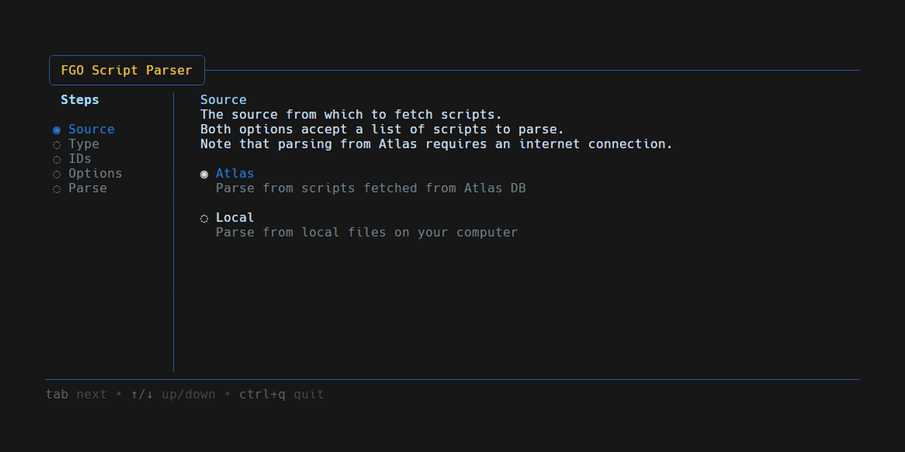

A TUI application to get the actual dialogue line and character count for FGO.

## Usage & Output

Running the `fgo-script-parser.exe` will launch the interface in a terminal window.  
**Note that currently CLI functionality has been removed and will be added back in a later version.**

You can use this program to either fetch scripts from Atlas, or parse files stored locally on your device.

By default the result will output to `script-length.csv` in the same location as the script as well as print a table to the TUI. If the `No File` option is enabled, the result will only print to the TUI.

Regardless of output destination, the format is a tab-separated list with the format:  
`id    name    total lines    total characters`.  
A column for calculating the approximate English word count can be optionally added.

When parsing local files, it is possible to parse either entire directories, or individual files (in which case the file extension must be included. FGO story scripts are in `.txt` format by default).  
If the given path is a directory, the script will traverse every underlying path until it finds a file to open. It will then count the total lines and characters in the current directory, write the result to the output, and repeat for any remaining folders.  
**Note: the script will likely not work if you have files and folders mixed on the same level**).

## How it works

### Regex matching

The script regex-matches dialogue lines with the following pattern: `(＠([A-Z][：:])?(.*)\n)(.*?\n(?:.*?\n)?)?(.*?)\n\[k\]|(？.+?：.+)`

`(＠([A-Z][：:])?(.*)\n)(.*?\n(?:.*?\n)?)?(.*?)\n\[k\]` should match any regular dialogue line, whether standard format, narration (no nametag), or interspersed with function tags.

`(？.+?：.+)` should match any player choice, including ones with special interactions, such as in LB6.

### Character counting

To clean the lines for counting, a pattern of `(\[[^#&]+?\]|[\[\]#&:]|？.+?：|^＠.+|\n)` is used.

This should clear out any regular function tags in the text (`[r]`, `[line 3]`, `[image *]` etc), while only removing the square brackets, hashtag, ampersand, and colon for any ruby tags (`[#計画:コ　ト]` becomes `計画コ　ト`) or gender tags (`[&ああ:うん]` becomes `ああうん`).  
The same goes for any emphasis tags, which are structured like ruby tags, but without the colon.

FGO sometimes uses images to insert text with a different font, but there is no possible way to count that using the source script itself, so this count is _as close as we can get_.

**I have no way of really confirming the character count, as opposed to line count, but it looks correct compared to line count and previous data.**

### Special cases

For OC2, the appendix quest is not considered part of the quest list for war `403`, so it won't be fetched automatically when using Atlas. Because of this, there's a special clause when entering ID 403 when parsing Atlas war IDs, to also fetch the script from quest `4000327`, which is the appendix quest. This quest should be part of whatever quest list the Bleached Earth has, so take note of that.

For the Ordeal Call Prologue, the two scripts `0400010110` and `0400019910` are actually the exact same script (one is just a redirect to the other, for some reason). The counting script doesn't take this into account, so you either need to divide the total ouput for this by 2, or simply remove one of the files from wherever you are counting (the total lines for this should be 95, for reference).
